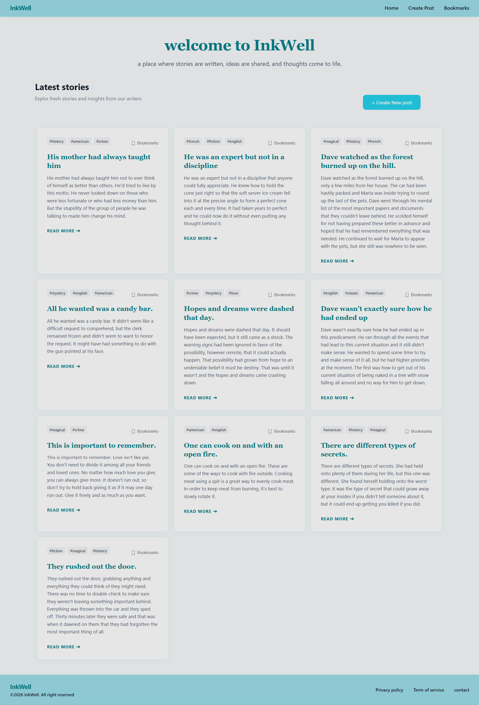
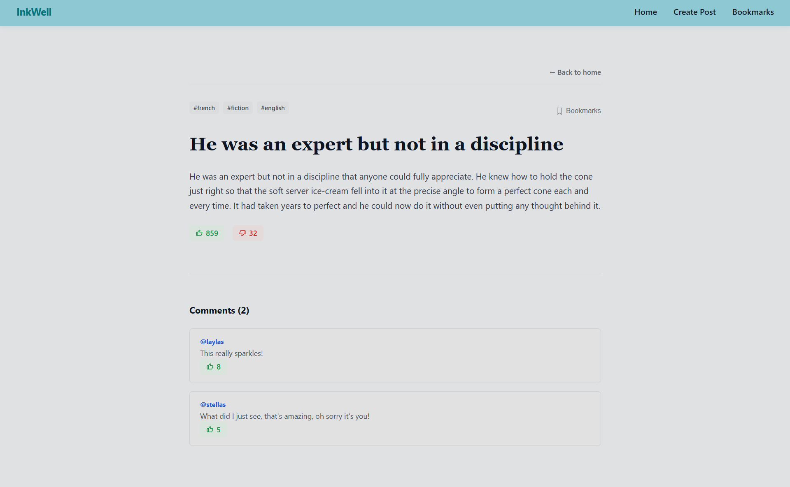
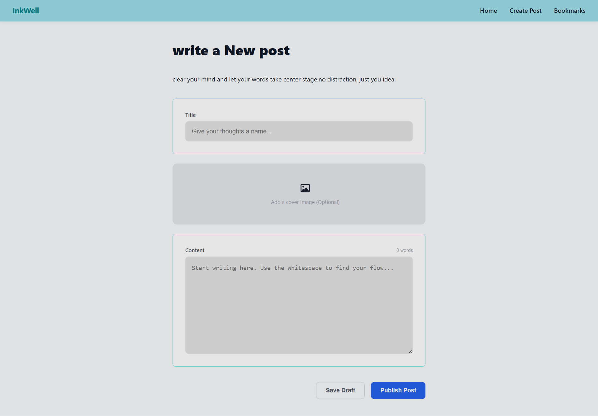
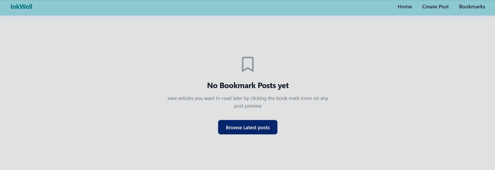

# 🖋️ InkWell – Personal Blog Application

InkWell is a clean, modern, and responsive blog application built with **React**, **Jotai**, and **CSS**. It allows users to browse blog posts from the **DummyJSON API**, read full articles with comments, create their own local posts, and bookmark their favorite stories.

---

## ✨ Features

- 📚 Browse the latest blog posts fetched from the DummyJSON API
- 📖 View complete article details with related comments
- 📝 Create custom blog posts locally
- 🔖 Bookmark favorite articles using Jotai global state
- 🏷️ Display dynamic tags for every post
- ⚡ Loading and error handling for API requests
- 📱 Fully responsive design for desktop and mobile devices

---

## 📸 Screenshots

### 🏠 Home Page



### 📖 Blog Details



### ✍️ Create Post



### 🔖 Bookmarks



---

## 🛠️ Tech Stack

- **React**
- **CSS3**
---

## 📂 Project Structure

```text
blog-app/
├── screenshots/
│   ├── home.png
│   ├── details.png
│   ├── create-post.png
│   └── bookmarks.png
├── public/
├── src/
│   ├── atoms/
│   │   └── bookmarkAtoms.js
│   ├── components/
│   │   ├── BlogCard.jsx
│   │   ├── BlogForm.jsx
│   │   └── Navbar.jsx
│   ├── pages/
│   │   ├── Home.jsx
│   │   ├── BlogDetails.jsx
│   │   ├── CreatePost.jsx
│   │   └── Bookmarks.jsx
│   ├── App.jsx
│   ├── main.jsx
│   └── index.css
├── package.json
├── vite.config.js
└── README.md
```

---

## 🚀 Getting Started

### 1. Clone the repository

```bash
git clone https://github.com/your-username/blog-app.git
```

### 2. Navigate to the project

```bash
cd blog-app
```

### 3. Install dependencies

```bash
npm install
```

### 4. Start the development server

```bash
npm run dev
```

The application will be available at:

```
http://localhost:5173
```

---

## 🌐 API

This project uses the free **DummyJSON API**.

### Get Posts

```text
https://dummyjson.com/posts
```

### Get a Single Post

```text
https://dummyjson.com/posts/{id}
```

### Get Comments for a Post

```text
https://dummyjson.com/comments/post/{id}
```

---

## 📖 What I Learned

This project helped me practice:

- Building reusable React components
- Managing application state with Jotai
- Client-side routing using React Router
- Fetching data from REST APIs
- Handling loading and error states
- Conditional rendering
- Creating reusable forms with validation
- Responsive UI design using CSS
- Organizing a scalable React project structure

---

## 🚀 Future Improvements

- 🔍 Search blog posts
- 🏷️ Filter posts by tag
- ❤️ Like and unlike posts
- 🌙 Dark mode support
- 💾 Persist bookmarks using Local Storage
- 🔐 User authentication
- ✏️ Edit and delete custom posts

---

## 📄 License

This project is open source and available under the **MIT License**.

---

## 👨‍💻 Author

**Amir Nesru**

- GitHub: https://github.com/amirnesru

If you found this project helpful, consider giving it a ⭐ on GitHub!
